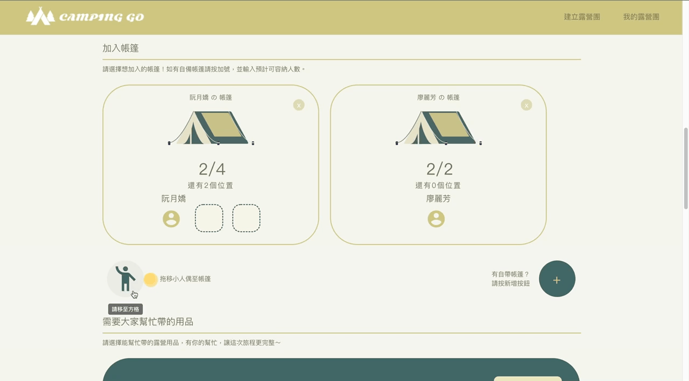

 

  
 

 
  

[Camping Go][1],
A group camping platform that allows you to find a like-minded group and start your camping career easily! Features include efficient tent arrangement planning, and second-hand camping supplies exchanges.

> ### As a member

[1]: https://camping-go-14942.web.app/

- You can choose any of your favorite camping groups to join on Camping GO .
- In the group, drag and drop to select the tent.
- Upload your second hand supplies and exchange with your teammate.

 

> ### As a camping group of header

- received feedback from your group members, in order to optimize the process next time.
- create your camping group quickly and also can set private mode that have fun with friends.
- received a notification when members withdraw from the group.

 

# Demo link

For your complete user experience, please login with the account provided below

Web: https://camping-go-14942.web.app/

User: fun@gmail.com

Password: funfun

 

 

# Features

- efficient tent arrangement planning.

select the tent with drag and drop, claim necessary camping supplies of the group.

 

- **second-hand camping supplies exchanges.**

upload second-hand camping supplies to exchanges with your group members.

- **personal recommendation**

No idea to find your favorite camping group?

Personalized recommendation with the camping group that suits you best.

  

- **Choose your purpose city to go**

Which city do you want to go ? according to the city to find your favorite camping group.

- Paired with kicking member out of the group or quit the group by yourself.

# Technologies

> Front-End Fundamental

- HTML / CSS / JavaScript
- RWD
- FlexBox

> Libraries

- React
- React router

- Hooks
- Styled-components

- Material UI

> Firebase

- Authentication
- Firestore Database
- Storage
- Hosting

> Other

- react-select
- react-google-places-autocomplete
-

# Contact Me

If you got any problem or suggestion with Re-Live, please feel free to contact with me via email.

Author: Ann Shen 

Email: yazu0419@gmail.com
